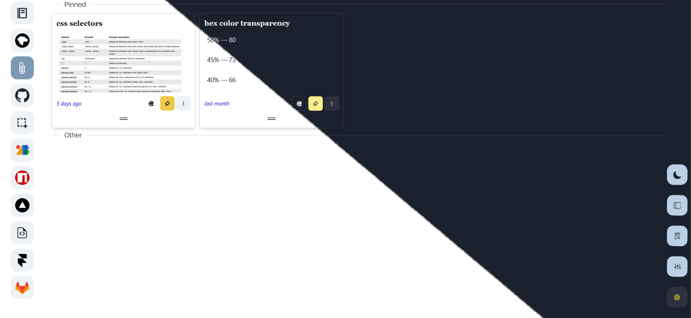

<p align="center">

</p>
<hr >

## About

This is a web extension that helps you create notes from selected text and save copied images and screenshots.

## How it works

Select a text and hit save , this will automatically generate a collection , text note and an icon then save it ,  
or copy paste / drag into the sidebar, this will let you save copied images and screenshots (use firefox's "take screenshot" feature, or any tool that let you copy the image).

- All notes are saved locally and catogorized by website.
- Create and customize collections
- Drag tabs to reorder your collections
- Drag/Drop and search notes.
- Light / Dark Theme .
- Export / import your data

## Install

you need yarn and NodeJs 14+

```
yarn install
```

then

```
yarn build
```

Enable developper mode from the extensions page.
Click "Load Unpacked" and select the build folder.
